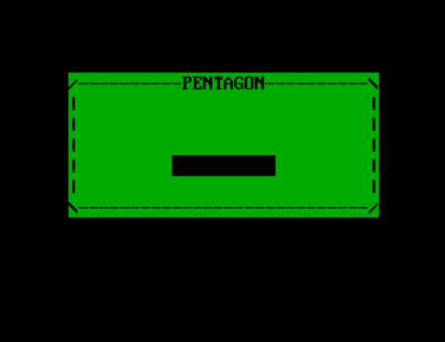
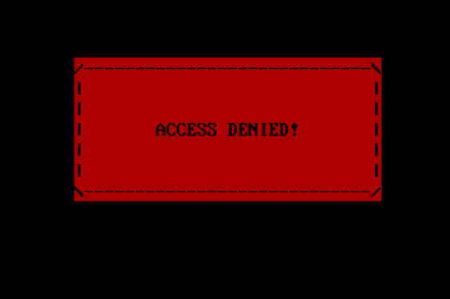
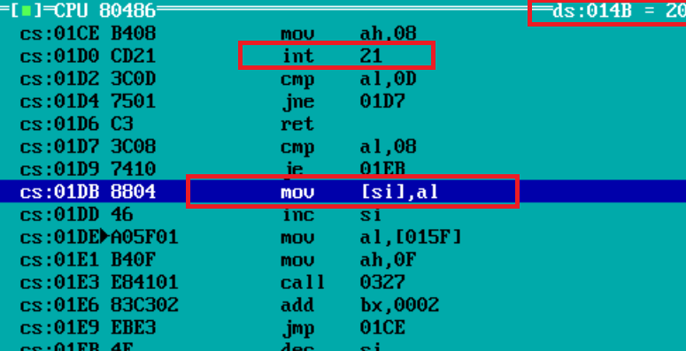
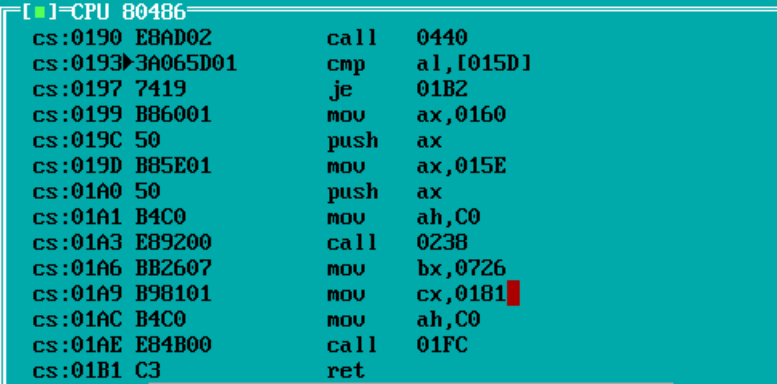
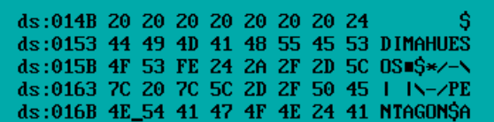
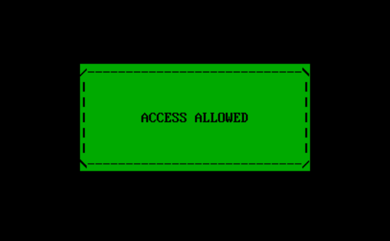
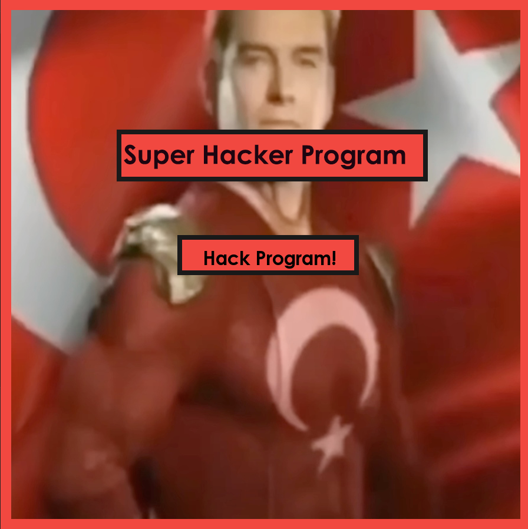
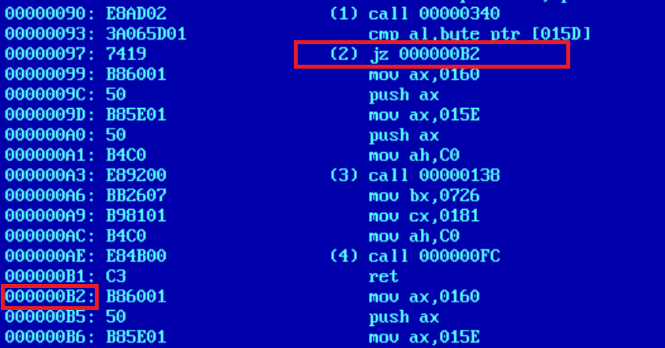
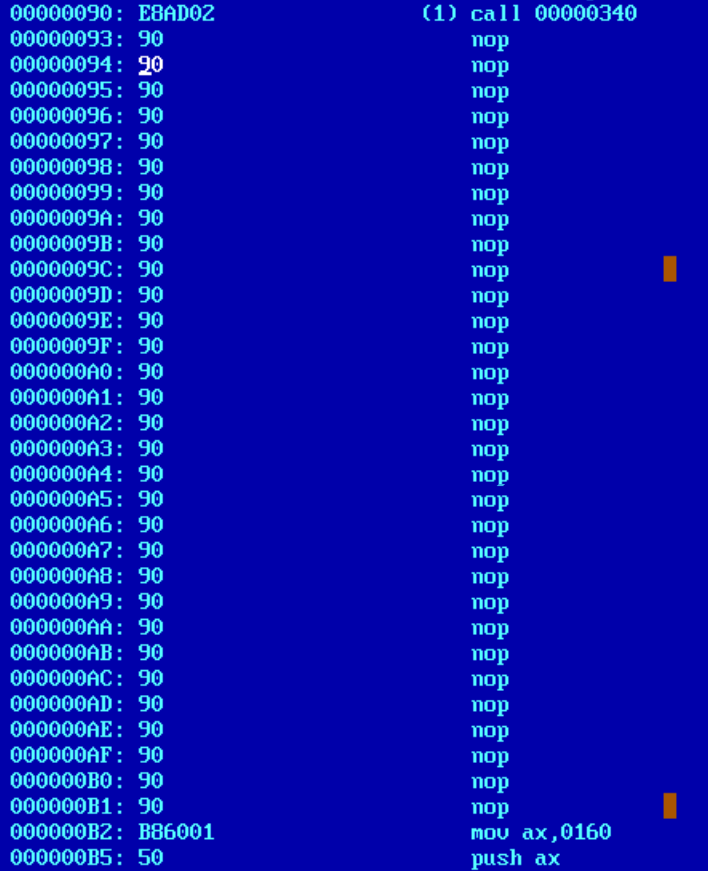

# 💥Dimas Hack💥

## Описание

Этот взлом является частью курса Системного Программирования в МФТИ.
В нем я хотел показать, как в **ОС DOS** с помощью знания **ASM x86** можно взламывать программы.

## Почему именно DOS?

В DOS'е нету большинства системных проверок, которые есть в Windows и Linux (к примеру в DOS, можно изменять сегмент констант в программе). Эта ОС предоставляет хакеру больший горизонт возможностей, по сравнению с другими ОС.

## Взламываемая программа

Мой [друг](https://github.com/SvetoCopy/), приготовил для меня экземпляр программы для взлома, написанной на x86 ASM, которая требует ввести пароль, неизвестный мне.

**Интерфейс программы:**

При вводе неправильного пароля, **программа отклоняет доступ:**

Попробуем взломать ее **2 разными способами**.

## Взлом

### Первый способ: переполнение буфера

Используя **Turbo Debugger** посмотрим дизасемблированный код программы.
Смотря код, я нахожу процедуру, отвечающую за ввод данных в программу с помощью 21-го прерывания.
Также, следом за прерыванием, можно увидеть адрес буфера, куда записывается содержимое пользовательского ввода:

Теперь мы знаем, что **0x014B** - адрес буфера для пользовательского ввода.

Следом за этими фунцкиями, я нахожу проверку для пароля, которая сравнивает **хэш сумму** введенного пароля с **хэш суммой** правильного пароля.

Оказывается, что адрес, по которому расположена хэш сумма (**0x15D**) следует прямо после адреса буфера для пользовательского ввода! (**0x014B**).

Зная эту информацию, можно взломать эту программу ☠️.

**Алгоритм взлома:**
1. Вводим любой пароль и с помощью TurboDebugger смотрим, какую хэш сумму он образует.
2. С помощью переполнения буфера, изменяем исходную хэш сумму, на хэш сумму введенного нами пароля
3. Программа не заметит подмены и предоставит нам доступ. **PROFIT!**

### Второй способ: замена байт исходной программы

Используя библиотеку **SFML** и ЯП **C++** я написал графическую утилиту, которая с помощью замены байт убирает проверку пароля, тем самым взламывая программу.

**Интерфейс утилиты:**

**Как она работает?**

Используя **Qview**, найдем адрес байтов проверки пароля:

Мы видим, что если пароль совпадает с нужным, то программа начинает выполняться с адреса **000000B2**.
Зная это, с помощью C++ функций **fseek** и **ftell** наша утилита заменит байты программы c **00000097** по **000000B2** инструкциями **nop** (0x90).

Этим мы полностью убрали проверку пароля! **PROFIT!**

💘 **Dmit DREC MIPT 2024**
